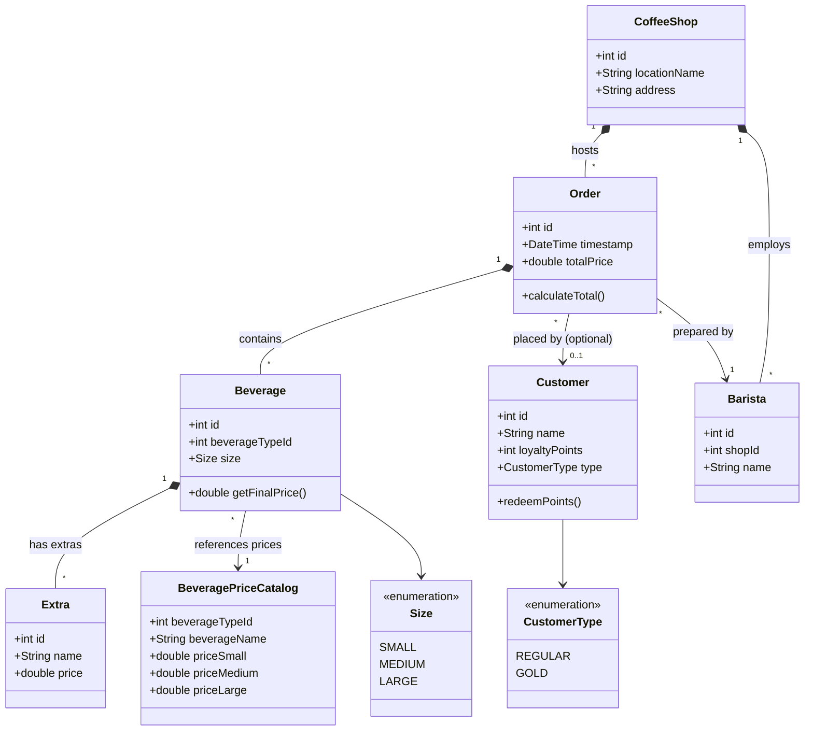
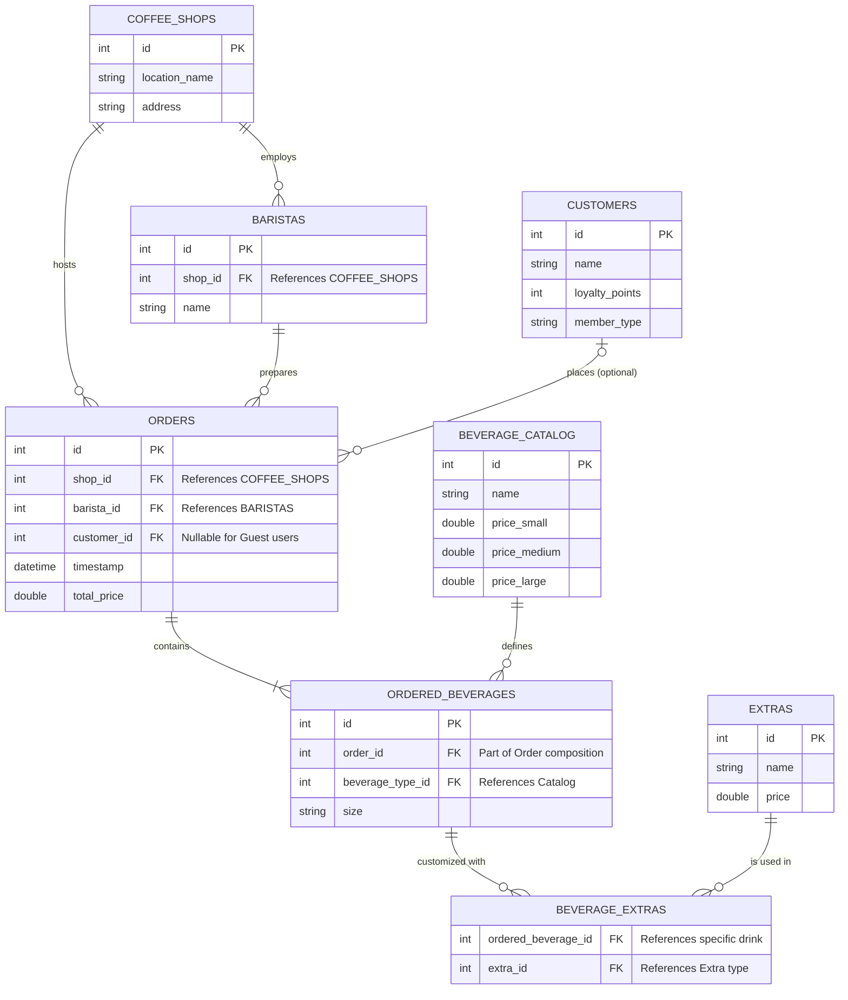

# Coffee Shop Digitalization - Sarah's Cafe

This project represents the design phase for a coffee shop management system, focusing on scalability, clear object-oriented structure, and data integrity.

## 1. Class Diagram (Problem 1.1)

The class diagram below outlines the core entities of the system, their properties, methods, and the relationships between them.

# Design Justification

The system design was carefully crafted to address key business requirements for a coffee shop chain, ensuring scalability, customization, and accountability across multiple locations.

## 1. Multi-Location Scalability (Chain Support)
- Introduced the **CoffeeShop** class to manage the business as a chain.
- Each **Barista** is assigned to a specific shop, and every **Order** is linked to a location, allowing for per-shop revenue tracking and inventory management.

## 2. Pricing Scalability
- Used the **BeveragePriceCatalog** to decouple the global menu from individual orders.
- This centralizes prices for all sizes (**Small, Medium, Large**) across the entire chain, allowing for menu updates without affecting historical order data.

## 3. Guest & Member Flexibility
- The relationship between `Order` and `Customer` is **optional (0..1)**.
- This allows the system to process "Guest" transactions for walk-in customers while still providing full loyalty features for registered **Regular** or **Gold** members.

## 4. Customization & Instance Logic
- Implemented **composition** between `Beverage` and `Extra`. 
- While the catalog stores the "recipe," the `Beverage` class represents the **physical cup** prepared for a customer. If an order is cancelled, the specific cup and its added extras are removed, while the catalog remains intact.

## 5. Loyalty System
- Integrated `CustomerType` to manage dynamic point earning:
  - **Regular members:** 1 point per euro spent.
  - **Gold members:** 2 points per euro spent.
- The `redeemPoints()` method facilitates the "free drink" reward logic as per business requirements.

## 6. Accountability
- Every `Order` tracks the specific **Barista** and the **CoffeeShop** location.
- Automatic **timestamping** and total price calculation ensure business transparency and staff performance monitoring.

# Database Diagram (Problem 1.2)

The following **Entity Relationship Diagram (ERD)** represents the data persistence layer for the class model defined in section 1.1.  

It translates the object-oriented relationships—such as the composition between **Orders** and **Beverages**—into a **relational database schema**, ensuring that all business rules, including **multi-location tracking** and **optional customer membership**, are enforced at the data level.

# Database Logic & Key Constraints

## One-to-Many (1:N)
A **CoffeeShop** hosts many **Orders**, and a **Barista** prepares many **Orders**.  
This is enforced via **Foreign Keys** (`shop_id`, `barista_id`) in the `ORDERS` table to ensure full accountability.

## Many-to-Many (M:N) Resolution
To allow a single drink to have multiple extras (e.g., vanilla syrup and an extra shot), we introduced the **BEVERAGE_EXTRAS** junction table.  
This links `ORDERED_BEVERAGES` and `EXTRAS` without data redundancy.

## Nullability for Guests
The `customer_id` in the `ORDERS` table is **nullable**.  
This matches the business requirement that membership is optional.

## Data Normalization
By storing **sizes** and **prices** in the `BEVERAGE_CATALOG` and referencing them in `ORDERED_BEVERAGES`,  
we protect historical sales data from future menu price fluctuations.